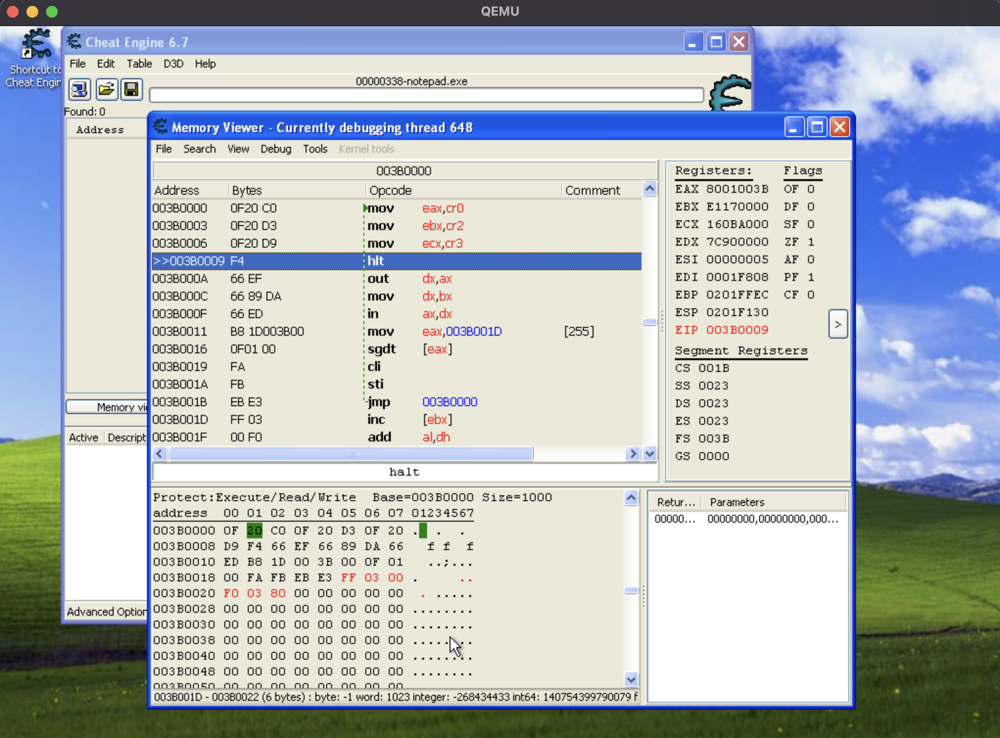

===========
QEMU DANGER x86 README
===========

QEMU DANGER x86わ、QEMUのForkです。これわ仮想x86/64 CPU権限の無視する。

例えば、Ring3のプログラムがRing0の命令を実行ができる。DATAの読み書きもできる！

.. _WindowsDanger: https://github.com/UEFI-code/WindowsDanger

面白いでしょう？でも、これわ危険です。`WindowsDanger`_ の一緒に研究です。

===========

Magic Instructions
==================

I/O portの"233"ど"0x2333"に出力値捕獲する。そして、"\a"をターミナルに出力する。

例えば、WinXPのCMDで次の実行する：

..code-block:: shell

  debug
  -o e9 e9

そして、一つの"\a"が出力される。

または、次の実行する：

..code-block:: asm

  mov dx, 2333h
  mov ax, 2333h
  out dx, ax

そして、ふたつの"\a"が出力される。

QEMU is a generic and open source machine & userspace emulator and
virtualizer.

QEMU is capable of emulating a complete machine in software without any
need for hardware virtualization support. By using dynamic translation,
it achieves very good performance. QEMU can also integrate with the Xen
and KVM hypervisors to provide emulated hardware while allowing the
hypervisor to manage the CPU. With hypervisor support, QEMU can achieve
near native performance for CPUs. When QEMU emulates CPUs directly it is
capable of running operating systems made for one machine (e.g. an ARMv7
board) on a different machine (e.g. an x86_64 PC board).

QEMU is also capable of providing userspace API virtualization for Linux
and BSD kernel interfaces. This allows binaries compiled against one
architecture ABI (e.g. the Linux PPC64 ABI) to be run on a host using a
different architecture ABI (e.g. the Linux x86_64 ABI). This does not
involve any hardware emulation, simply CPU and syscall emulation.

QEMU aims to fit into a variety of use cases. It can be invoked directly
by users wishing to have full control over its behaviour and settings.
It also aims to facilitate integration into higher level management
layers, by providing a stable command line interface and monitor API.
It is commonly invoked indirectly via the libvirt library when using
open source applications such as oVirt, OpenStack and virt-manager.

QEMU as a whole is released under the GNU General Public License,
version 2. For full licensing details, consult the LICENSE file.

Documentation
=============

Documentation can be found hosted online at
`<https://www.qemu.org/documentation/>`_. The documentation for the
current development version that is available at
`<https://www.qemu.org/docs/master/>`_ is generated from the ``docs/``
folder in the source tree, and is built by `Sphinx
<https://www.sphinx-doc.org/en/master/>`_.

Building
========

QEMU is multi-platform software intended to be buildable on all modern
Linux platforms, OS-X, Win32 (via the Mingw64 toolchain) and a variety
of other UNIX targets. The simple steps to build QEMU are:

if you are building on a Mac:

.. code-block:: shell

  brew install pkg-config glib libtool automake autoconf pixman ninja sdl2
  pip3 install meson

.. code-block:: shell

  mkdir build
  cd build
  ../configure
  make -j8

Additional information can also be found online via the QEMU website:

* `<https://wiki.qemu.org/Hosts/Linux>`_
* `<https://wiki.qemu.org/Hosts/Mac>`_
* `<https://wiki.qemu.org/Hosts/W32>`_